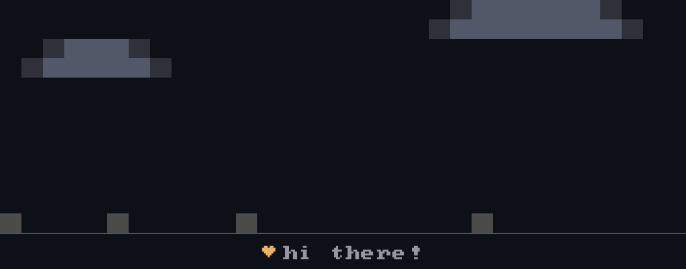
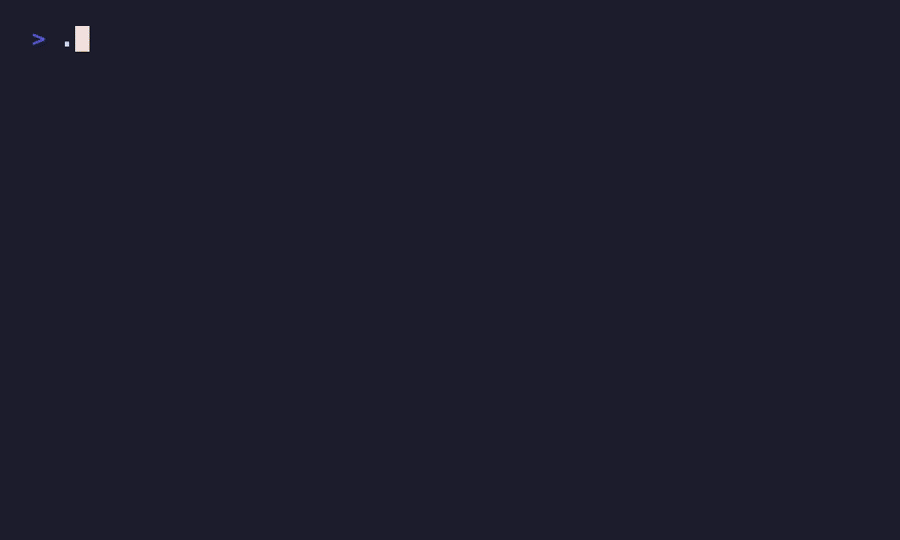
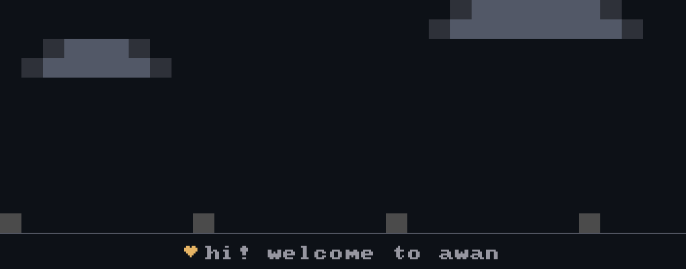
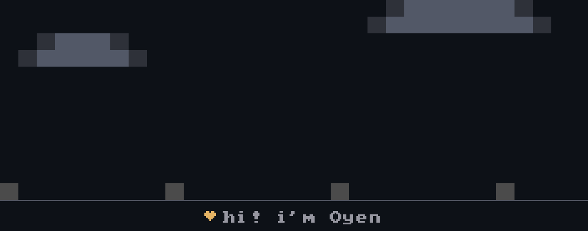

# awan ☁️

[](https://codewithwan.github.io/awan/)
[](https://github.com/codewithwan/awan/actions/workflows/ci.yml)
[](https://crates.io/crates/awan-cli)
[](#license)

A tiny pixel character that walks your GitHub contribution year.

<p align="center">
  
</p>

He reads your real numbers, brags when the month went well, and goes to sleep
when it didn't. A workflow in **your** repo redraws him nightly — nothing to
host, no account, no token.

<p align="center">
  <a href="https://codewithwan.github.io/awan/"><b>→ build yours in the browser</b></a>
</p>

<!-- The banner up top covers this for now; assets/demo.gif is still here if the
     raw terminal loop ever earns the spot back.

<p align="center">
  
</p>

<p align="center"><sub>One loop of the show, in a real terminal.</sub></p>
-->

## Put him on your profile

Three files in the repo named after you. No secrets to set up: the token GitHub
Actions already gives you reads everything he needs.

**[Build it in the browser →](https://codewithwan.github.io/awan/)** Arrange the
beats, watch it play, download the folder. The preview runs the real engine
compiled to wasm, so the frames you see are the frames CI draws — and you can
draw your own character while you're there.

Nothing is stored and there's no server behind it. Your config lives in your
repo and the workflow runs there, which is also why this page can't break your
banner.

Prefer files? Copy the ready-made setup and edit one:

```sh
cp -r profile/sample/. my-profile/   # awan.json + a GitHub Action + a profile README
cargo run -p awan-profile -- whoami --config my-profile/awan.json
```

Want the numbers without the character too? A one-line workflow input also draws
a **stats banner** — all-time contributions, current and longest streak, with dates —
as its own image. See [`profile/`](profile#the-stats-banner).

Full walkthrough and the `awan.json` format: **[`profile/`](profile)**. Built as
a separate, opt-in crate, so the core `awan` stays untouched.

## He also lives in your terminal

The banner is a side effect: awan is a character engine first, and the same
character runs in a terminal, reacts to your shell, and can be embedded by any
CLI that can spawn a process.

<p align="center">
  
</p>

<p align="center">
  <sub>
    That's awan introducing awan — his own welcome, his own install line, and
    this repo's real stars and version, redrawn every night by the same workflow
    you'd use. If it ever breaks, you'll see it here first.
  </sub>
</p>

```sh
npx @codewithwan/awan demo         # try it, no install (needs Node)
npm i -g @codewithwan/awan         # npm      → prebuilt binary
pip install awan-cli               # PyPI     → prebuilt binary
brew install codewithwan/awan/awan # Homebrew → prebuilt binary
cargo install awan-cli             # Cargo    → from source
# …or grab a binary straight from the Releases page
```

Every route installs the same `awan` command. The npm/PyPI/Homebrew packages
just fetch the prebuilt binary — no Rust toolchain needed.

Then:

| Command | What it does |
|---|---|
| `awan demo` | Play the full show on a loop (Ctrl+C to stop) |
| `awan demo --hatch` | Replay the first-run hatching intro |
| `awan demo -c characters/oyen.toml` | Same show, different character |
| `awan busy "compiling"` | The making-things loop with an animated caption — a living progress indicator |
| `awan sing "line one" "line two" …` | Karaoke: he steps to a mic and sings your lyrics, lighting them up word by word |
| `awan react cmd.failed` | Play the character's one-shot reaction to an event, then exit |
| `awan watch` | Ambient companion that reacts to events read from stdin (or `--pipe`) |
| `awan statusline "deploying"` | One static line — a tiny face, name and status — for prompts, tmux, or a Claude Code statusline |

`awan watch` turns him into a companion that reacts to your shell in real
time — source [shell/awan.zsh](shell/awan.zsh) and run `awan watch --pipe`
in a spare pane; he goes busy while a command runs, celebrates when it passes,
and chars when it fails. Which event maps to which scene is per-character data
(`[reactions]` in the TOML).

He renders **seam-free by default**: every pixel is painted as a coloured
cell background, so the font's line spacing is filled in and there are no
gaps between rows on any terminal (macOS Terminal.app included). Two other
looks are a flag away:

- `--size big` — the classic block-textured look (`░`/`▓` dither).
- `--size compact` — seam-free *and* half as tall (two pixel rows per cell).

**Status: early development (v0.0.x).** The engine is ported 1:1 from a
battle-tested Go implementation and verified frame-by-frame. Expect breaking
changes until v0.1.

## Works with any language

awan is a **binary plus a text protocol**, not a library you link. Anything
that can spawn a process and write a line of text can embed it — no SDK.

```js
// Node — npm i @codewithwan/awan
const awan = require("@codewithwan/awan");
const job = awan.busy("deploying");
await deploy();
job.stop();
```

```python
# Python — pip install awan-cli
import awan
awan.react("task.done")
```

```sh
# Any shell — feed events to an ambient companion
printf 'cmd.start\n' >> events   # he goes busy
printf 'cmd.ok\n'    >> events   # he celebrates
```

Events are plain lines (`cmd.start`, `cmd.ok`, `cmd.failed`, `task.done`,
`idle`) and each character's `[reactions]` decides what they do. Ready-made
wrappers for Node, Python, Go and shell live in [`clients/`](clients); the
full guide is [**docs/INTEGRATE.md**](docs/INTEGRATE.md).

## Use it for

- **A build/deploy companion** — he works while the job runs, celebrates when
  it passes, chars when it fails.
- **A friendlier CI / pre-commit gate** — a reaction at the end instead of a
  wall of green text.
- **A live prompt or tmux badge** — `awan statusline` in your `PROMPT_COMMAND`.
- **An ambient desk buddy** — `awan watch` reacts to your shell in real time.
- **Your own CLI's personality** — call the same API from inside your tool.

Runnable, self-contained examples for each language are in
[**`usage/`**](usage) — `cd usage/node && npm install && npm start`, and so on.
From your code it's just `awan.react("task.done")`; you never spawn anything.

## Characters

Characters are plain TOML — pixel rows plus a palette, **zero Rust**:

### The cast

**Awan** ☁️ — the reference cloud buddy · [`characters/awan.toml`](characters/awan.toml)

<p align="center">
  
</p>

**Oyen** 🐈 — a chunky orange cat · [`characters/oyen.toml`](characters/oyen.toml)

<p align="center">
  
</p>

Every scene works with every character — bake, sing, juggle, nap. Point
`"character"` at any spec and the whole reel restyles itself; adding one to the
cast is TOML only.

The heart of a spec is the pixel art — here's the sprite block, abridged
(`eye_row`/`mouth_row`/`legs_row` point the engine at the rows to animate):

```toml
[sprite]
rows = [
    " #+    +# ",   # '#' solid · '+' dense · '-' light · '@' eye
    "+########+",
    "##@@##@@##",   # the engine derives blinks, glances & happy eyes from here
    "###----###",   # …and opens the mouth here when startled
    "+########+",
    " # #  # # ",
]
eye_row = 2
mouth_row = 3
legs_row = 5
# …plus sit_rows, leg_frames, a palette, and metadata
```

Copy [characters/awan.toml](characters/awan.toml) as your starting point,
edit the art, and run `awan demo -c my-character.toml`. The loader validates
the spec with friendly errors and drops your character into the full scene
library — no Rust, no rebuild of the engine.

## How it works

| Crate | Purpose |
|---|---|
| `awan-core` | Scene engine: deterministic frames from `(tick, character)` — no wall-clock, no RNG, snapshot-testable |
| `awan-render` | Terminal backends and color-depth detection |
| `awan` | Public embed API for Rust CLI authors: `wait` / `ask` / `react` (planned) |
| `awan-cli` | The `awan` binary |

## Roadmap

The banner is the product; everything else is how it's made.

- **Shipping** — profile banners with live numbers, the contribution year, a
  standalone stats banner (all-time contributions and streaks, no character), a
  browser editor with a character studio, and a reusable workflow you call
  rather than copy
- **Next** — more beats worth watching, and somewhere to show the characters
  people draw
- **Also true** — he's a terminal companion (`watch`, `busy`, `statusline`) and
  a character engine any CLI can embed. Both work today. Neither is the pitch,
  and that's a decision, not an oversight: a character card people want beats a
  library nobody asked for.

## Promises

No telemetry · no network calls · single static binary · characters are data.

## Contributing

Three lanes: character art (TOML only), scenes/skits (light Rust), or engine
work. See [CONTRIBUTING.md](CONTRIBUTING.md).

## License

MIT OR Apache-2.0, at your option.

---

Heritage: the engine began as `idl pet` (Go) inside the
[IDCloud](https://idcloud.app) CLI; awan is its standalone, embeddable second life.
