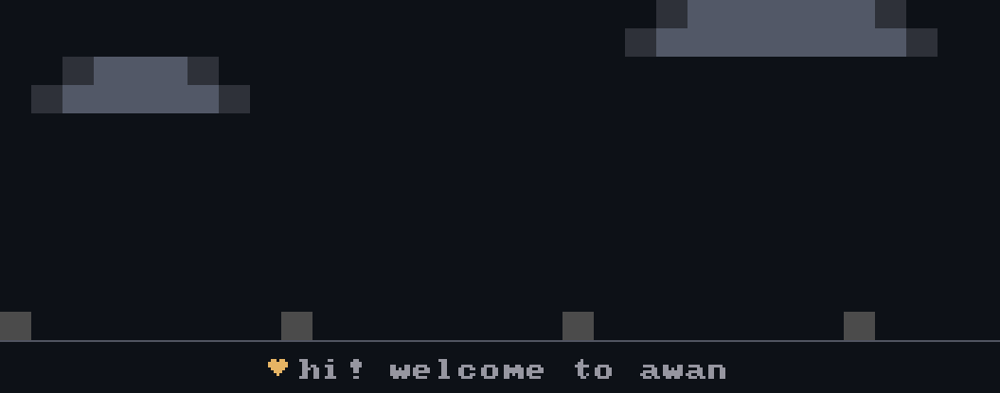
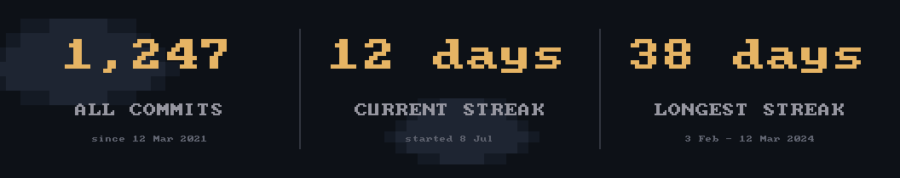

# awan profile

> **[Build one in the browser →](https://codewithwan.github.io/awan/)** Arrange
> the beats, watch it play, download the folder. The preview runs the real
> engine, so it draws the frames CI draws. Everything below is the same thing,
> by hand. generator

Turn awan into a **seam-free looping banner for your GitHub profile** — he walks
in and tells your story, then loops (~60s). A separate, opt-in tool: it never
ships with the core `awan`.

<p align="center">
  
</p>

Everything is driven by one file, [`awan.json`](sample/awan.json) — you control
the words **and** the order of the scenes.

## Two flavours, one engine

Same acts, same config shape — only the content differs. Pick a sample and edit:

| Banner | Sample | For |
|---|---|---|
| **Profile** | [`sample/awan.json`](sample/awan.json) | your `<you>/<you>` repo — bio, streak, song |
| **Project** | [`sample/project.json`](sample/project.json) | any repo README — what it does, install, stats |

<p align="center">
  
</p>

*The project flavour: he welcomes you, then opens a terminal and prints the
repo's numbers.* Drop `{ "act": "stats" }` into **either** config — it reads the
same `stats` array.

## The stats banner

A third output, and the only one with **no character**: three numbers in a row,
split by vertical rules — your all-time contributions, your current streak, your
longest streak — each with the dates it covers. It wants the whole width to
itself, so it's a separate image from the walking banner.

<p align="center">
  
</p>

```sh
awan-profile stats --config awan.json --out assets/stats-banner.gif   # drifting clouds, loops
awan-profile stats --config awan.json --out assets/stats-banner.png   # a still
```

The `.gif` drifts soft clouds behind the numbers and loops; the `.png` is a
still. Same command — the extension picks.

The three boxes come from `stat_boxes` in your config, which **CI fills** (like
`stats` and the streak) — you don't write them by hand. Each box is a
pre-formatted `value`, a `label`, and a `note` for the dates:

```jsonc
"stat_boxes": [
  { "value": "1,247",   "label": "CONTRIBUTIONS",  "note": "since 12 Mar 2021" },
  { "value": "12 days", "label": "CURRENT STREAK", "note": "since 8 Jul" },
  { "value": "38 days", "label": "LONGEST STREAK", "note": "3 Feb - 12 Mar 2024" }
]
```

To get it drawn and refreshed nightly, set the `stats_banner` input on the
workflow (see [Auto-update](#auto-update-on-github)). The all-time figures need
the calendar walked year by year from the year you joined, so the workflow only
does that when you ask for the banner.

## Get started

The [`sample/`](sample) folder is a ready-to-copy setup:

```
sample/
├── awan.json                     # ← profile flavour: bio, streak, song, scenes
├── project.json                  # ← project flavour: tagline, install, stats
├── README.md                     # a starter profile README (shows the GIF)
└── .github/workflows/awan.yml    # regenerates the GIF on every push
```

Copy it into your profile repo (`<you>/<you>`), edit `awan.json`, and push:

```sh
cp -r profile/sample/. my-profile/
cargo run -p awan-profile -- whoami --config my-profile/awan.json   # preview locally
```

Without `--gif` (or `output`) it previews one loop in the terminal and exits on
its own — no Ctrl+C.

## The `awan.json` format

```jsonc
{
  "username": "codewithwan",
  "character": "",                      // path to a character TOML; empty = the buddy
  "name": "Muhammad Ridwan",
  "role": "fullstack engineer",
  "location": "Indonesia",
  "stack": "Rust, Go & TypeScript",
  "streak": 0,                          // 🔥 badge, top-right. Leave it at 0:
                                        // CI counts it off your calendar, and
                                        // the badge hides itself when it is 0
  "song": "your favourite song",        // shown as: my fav song "…" - artist
  "artist": "the artist",
  "lyrics": ["your", "favourite", "song lines"],
  "stats": [],                          // "label:value" pairs, printed into the
                                        // terminal window by the `stats` act. CI
                                        // fills these: repos, stars earned,
                                        // followers, following
  "contributions": "",                  // one char per day, 0-4 = GitHub's own
                                        // quartiles, "." = no such day. 371 of
                                        // them = a year. CI writes it; you don't
                                        // — until it has, the wall stays empty,
                                        // so run the workflow once and look
  "contrib_year": 2060,                 // ↳ both filled in by the workflow too
  "contrib_recent": 183,
  "stat_boxes": [],                     // the stats banner's 3 boxes (no
                                        // character). CI fills these too — see
                                        // "The stats banner". Leave it empty.
  "output": "assets/awan.gif",          // where the GIF is written
  "scenes": [                            // ← reorder / add / remove freely
    { "act": "wave",     "say": "hi there! i'm {name}" },
    { "act": "present",  "say": "{role}" },
    { "act": "stroll",   "say": "based in {location}" },
    { "act": "rocket",   "say": "i build with {stack}" },
    { "act": "launch",   "say": "...then watch 'em take off!" },
    { "act": "bake",     "say": "and i love to eat" },
    { "act": "campfire", "say": "{streak}-day streak" },
    { "act": "contributions",
      "say":  "i'm very happy, {contrib_year} this year",   // as the wall rises
      "then": "and {contrib_recent} in the last 30 days" }, // as the month lights
    { "act": "{verdict}", "say": "CI decides: excited, or not" },
    { "act": "sing" },
    { "act": "soccer",   "say": "then a bit of football" },
    { "act": "sleep",    "say": "okay... nap time, zzz" }
  ]
}
```

| Act | What he does |
|---|---|
| `wave` | bounces in an excited hello |
| `present` | stands and introduces himself |
| `stroll` | walks along (the ground scrolls only here) |
| `rocket` / `launch` | builds a rocket, then launches it |
| `bake` | fetches an oven and bakes |
| `campfire` | drags in wood, throws a spark, the fire catches, then pops |
| `sing` | steps aside; lyrics play karaoke-style on the left |
| `soccer` | juggles a ball |
| `stats` | opens a little terminal window and *prints* your numbers into it, line by line |
| `contributions` | your GitHub year rises behind him; he walks over to the newest end and stands there while the last 30 days keep their colour and the year steps back |
| `sleep` | yawns, dozes (`zzz`), wakes up |
| `dance` | a little dance |

- **`say`** is the caption; `{name} {role} {location} {stack} {streak} {username}`
  are filled in, plus `{contrib_year}` and `{contrib_recent}`. The `sing` beat
  needs no `say` — it plays your `lyrics`.
- Omit `scenes` entirely for a sensible default story.

### He reacts to how the month went

It says three things, in three moments. `say` lands as the wall rises — *"i'm
very happy, 2060 this year"*. **`then` takes over the instant the spotlight
hits**, so the month is named on the tick it lights up rather than a beat later
— *"and 183 in the last 30 days"*. Any act can carry a `then`; only the wall
has a moment worth splitting on.

`streak` comes free with this act: the same calendar already says which days
you showed up, so the workflow counts back from today and fills it in. A blank
*today* doesn't break the run — you've still got the rest of the day.

The mood comes last, on its own beat. `{ "act": "{verdict}" }` is filled in by
the workflow from your own numbers: clear `BRAG_OVER` and he `dance`s, fall
short and he `sleep`s.

```yaml
BRAG_OVER: 100 # your bar for "a good month"
BRAG_SAY: "i'm so excited!"
COPE_SAY: "...i'll fix that, promise"
```

Set the bar to your own idea of a good month, and write both lines yourself —
they should sound like you, not like us. Keep every caption under ~42
characters or it runs off the edge.

It needs **no PAT and no secret** — the stock `GITHUB_TOKEN` reads a public
contribution calendar fine. As ever, CI does the fetching and the binary only
draws, so the renderer still never touches the network.

## Auto-update on GitHub

Two files in your profile repo, and only one of them is yours to think about.
The machinery lives here, so our bug fixes reach you by tag instead of by you
re-copying anything:

```yaml
# .github/workflows/awan.yml
name: awan profile
on:
  push: { branches: [main, master], paths: ["awan.json"] }
  schedule: [{ cron: "0 3 * * *" }]
  workflow_dispatch:

jobs:
  awan:
    uses: codewithwan/awan/.github/workflows/profile.yml@v0
    permissions:
      contents: write
    with:
      brag_over: 100 # your bar for "a good month"
      brag_say: "i'm so excited!"
      cope_say: "...i'll fix that, promise"
      stats_banner: assets/stats-banner.gif # optional; see "The stats banner"
```

Then reference the outputs in your profile `README.md`:

```markdown


```

No secrets to set up: the stock `GITHUB_TOKEN` reads everything this needs.

| input | default | what it does |
|---|---|---|
| `user` | the repo's owner | whose numbers to read |
| `config` | `awan.json` | where your config lives |
| `brag_over` | `100` | last-30 contributions that count as a good month |
| `brag_say` / `cope_say` | see above | what he says either side of that bar |
| `stats_banner` | *(off)* | path for the stats banner; set it to draw one |

### Which tag to point at

`@v0` **moves** as we release — new scenes and fixes arrive on their own, and
we keep `awan.json` compatible. It's the same deal as `actions/checkout@v4`.

`@v0.0.5` **freezes**. That tag's copy of the workflow pins the renderer to the
matching release, so the GIF it draws never changes under you. Pin it if you'd
rather read the thing once and know it can't move — it runs in your repo with
`contents: write`, and that's a reasonable thing to be careful about.

## Live numbers

The renderer never touches the network — that stays a promise of the binary.
Instead **CI fetches and the binary draws**: the sample workflow pulls the real
stars / forks / contributors / version / license with `gh api`, writes them into
`awan.json` with `jq`, then renders. It also runs nightly, so the numbers stay
fresh without you touching anything.

## Notes

- **Lyrics are yours** — put a couple of lines of your own favourite song in
  `lyrics`. The sample ships original placeholder lines.
- The GIF is a few MB raw; shrink it with
  `gifsicle -O3 --colors 64 assets/awan.gif -o assets/awan.gif`. No `--lossy`:
  it bought about 6% and ghosted the 14px contribution squares.

---

Why it's built this way — the seam, the CI/binary split, the config's shape:
[**docs/PROFILE.md**](../docs/PROFILE.md).
